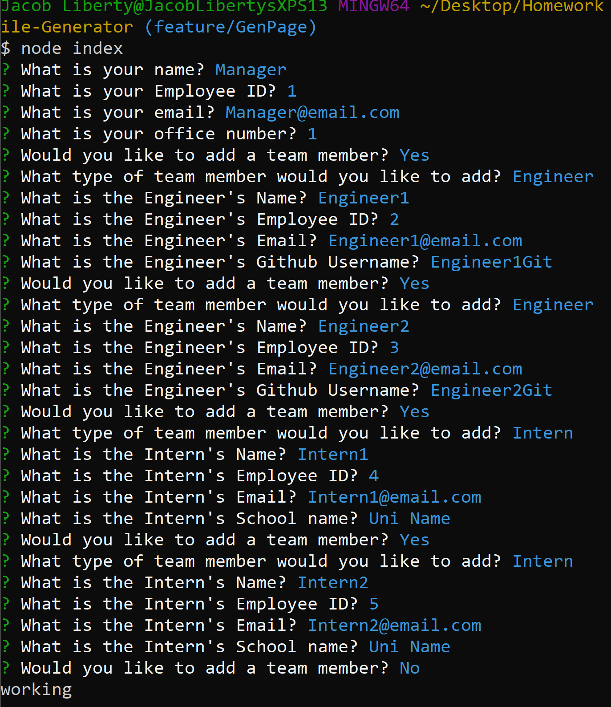
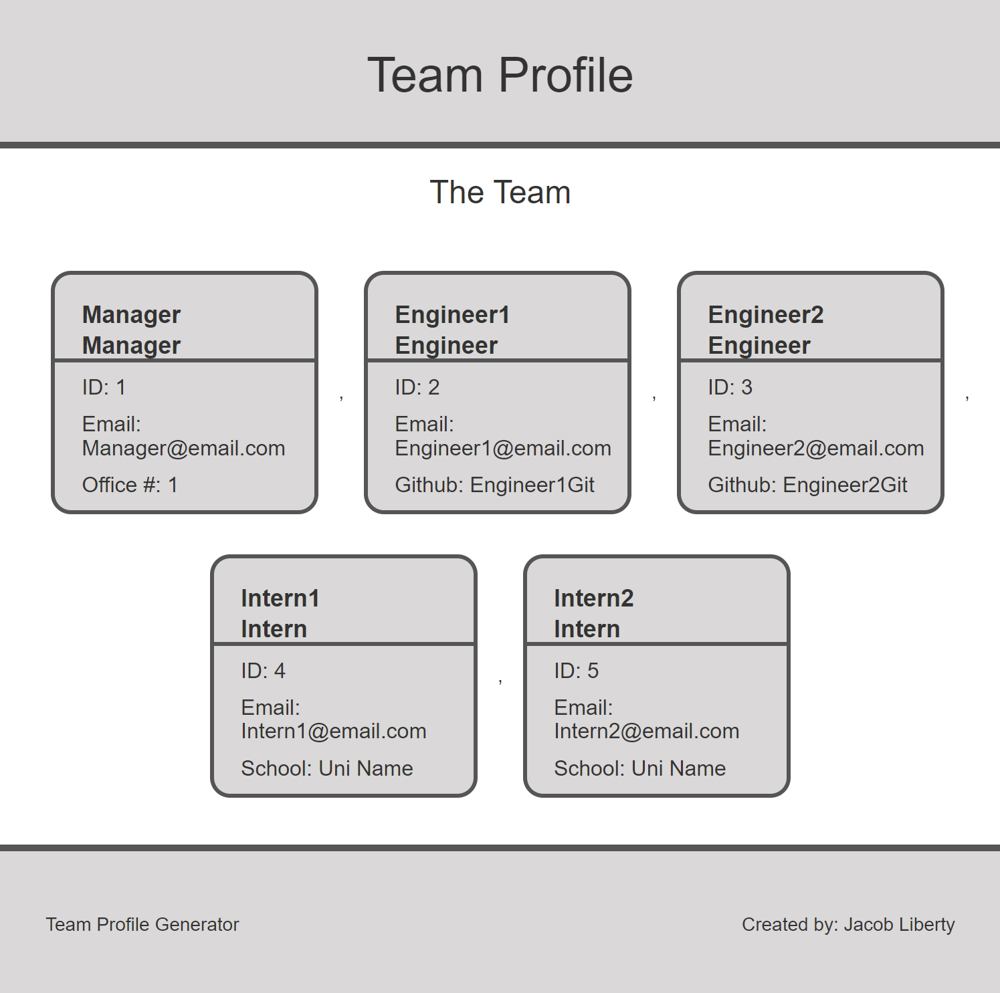

  # Team Profile Generator
  This project is not licensed

  ## Table of Contents:

  ---
  * [Description](#description)
  * [Installation](#installation)  
  * [Usage](#usage)  
  * [Assets](#assets)    
  * [Tests](#tests)  
  * [Questions](#questions)  

  ## Description

  ---
  This project will generate a team profile page comprised of a manager, engineers, and interns all of which have their specific information listed. The project is a node.js program that is used through console and will generate a page based on console inputs using inquire. The generated page and styles are stored in ./dist

  ## Installation:

  ---
  To install all necessary dependencies for this program,
  open the console and run the following command:  
  ```npm i```

  ## Usage

  ---
  To make use of this project first install depenedencies from the package.json, then run the program and fill out all prompts correctly.

  Console Prompts:
  

  When all members are added the page is completed and will be generated with styles in the ./dist folder.

  Generated Page:
  

  ## Assets

  ---
  ### Languages, libraries and assets used:
  - node.js  
  - inquire  
  - jest 
  - bootstrap  
  - JavaScript  
  - HTML  
  - CSS

  ## Tests

  ---
  To test this application run this command in the console:  
  ```npm run test```

  To run this application run this command in the console:  
  ```node index```

  ## Questions

  ---
  For any questions feel free to reach out through the following contacts:  

  Email: jacob.tobin.liberty@gmail.com  
  Github: https://github.com/JacobGit3  
  
